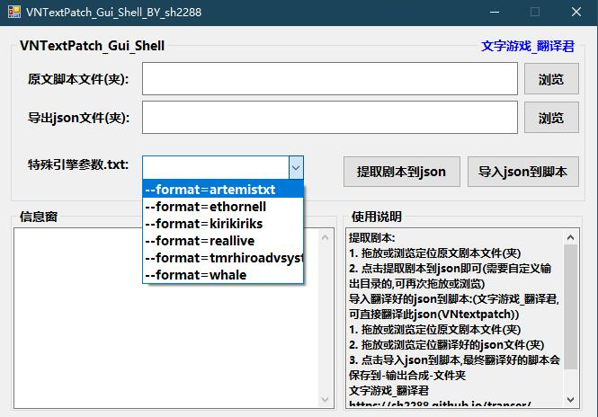

# VNTextPatch_GUI
### 这个VNtextPatch工具,配合[文字游戏_翻译君](https://github.com/sh2288/transer),如虎添翼🚀
VNTextPatch神器🚀的gui_shell,命令行苦手☺,终将得以解脱...

# VNTextPatch项目(目前大佬已存档该项目)[github](https://github.com/arcusmaximus/VNTranslationTools)
| Engine                               | Extension(s)   | Remarks                                                                        |
| ------------------------------------ | -------------- | ------------------------------------------------------------------------------ |
| AdvHD                                | .ws2           |                                                                                |
| ArcGameEngine                        | .bin           |                                                                                |
| Artemis                              | .asb/.ast/.txt | Append `--format=artemistxt` to command line for .txt                          |
| Buriko General Interpreter/Ethornell | (none)         | Append `--format=ethornell` to command line                                    |
| CatSystem2                           | .cst           |                                                                                |
| Cyberworks C,system                  | .a0            |                                                                                |
| KaGuYa                               |  message.dat   |                                                                                |
| Kirikiri                             |  .ks/.scn/.txt | Append `--format=kirikiriks` to command line for .txt                          |
| Majiro                               | .mjo           |                                                                                |
| Musica                               | .sc            |                                                                                |
| Mware                                | .nut           |                                                                                |
| Propeller/Stuff Script Engine        | .msc           |                                                                                |
| RealLive                             | .txt           | Append `--format=reallive` to command line                                     |
| Ren'Py                               | .rpy           |                                                                                |
| ShSystem                             | .hst           |                                                                                |
| Silky's/AI6WIN                       | .mes/.map      |                                                                                |
| Qlie                                 | .s             |                                                                                |
| Softpal                              | script.src     | Make sure text.dat and point.dat are available in the same folder              |
| SystemNNN                            | .nnn/.spt      |                                                                                |
| TmrHiroAdvSystem                     | .srp/(none)    | Append `--format=tmrhiroadvsystemtext` to command line in case of no extension |
| Whale                                | .txt           | Append `--format=whale` to command line                                        |
| YU-RIS                               | .ybn           |                                                                                |

